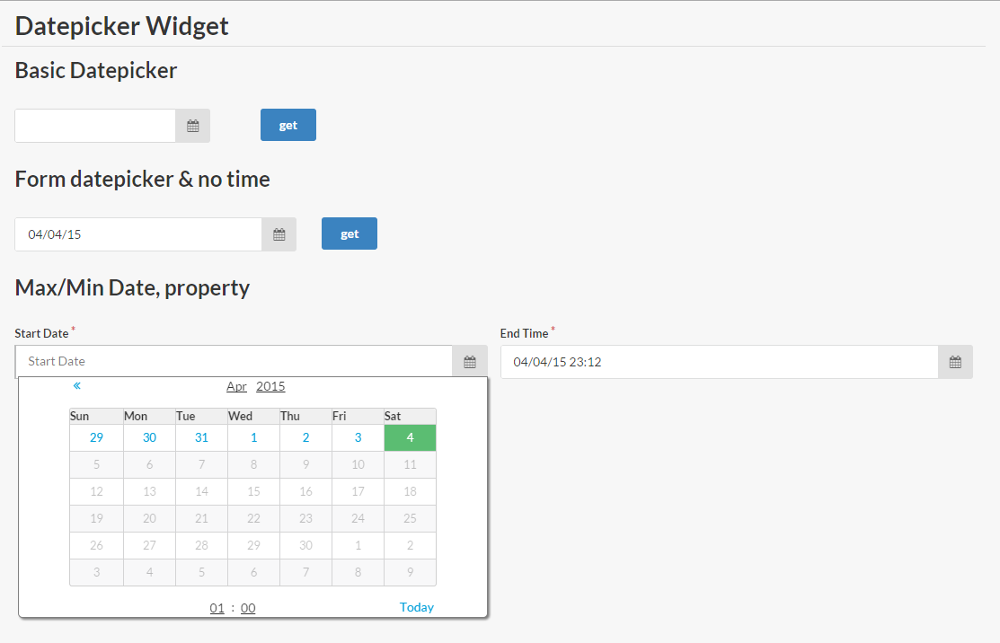

# sm-datepicker
Mithril semantic-ui datepicker widget

It requires [mithril](https://github.com/lhorie/mithril.js), sm-calendar, semantic-ui-table, semantic-ui-input, semantic-ui-icon and semantic-ui-grid

It is expected for mithril to be in global (m variable) or it will attempt to load it with `require('mithril')`, same for sm-calendar, [webpack](http://webpack.github.io/docs/) its recommended



## Demo

[Demo](http://pinguxx.github.io/sm-datepicker/)

```html
<!DOCTYPE html>
<html>

<head>
    <meta charset="utf-8">
    <meta http-equiv="X-UA-Compatible" content="IE=edge">
    <meta name="viewport" content="width=device-width, initial-scale=1">
    <link rel="stylesheet" href="https://cdnjs.cloudflare.com/ajax/libs/semantic-ui/1.10.3/semantic.min.css">
    <script src="https://cdnjs.cloudflare.com/ajax/libs/mithril/0.1.33/mithril.min.js"></script>
    <script src="https://cdn.rawgit.com/pinguxx/sm-calendar/master/Calendar.js"></script>
    <script src="DatePicker.js"></script>
</head>

<body>

    <script src="test.js"></script>
</body>

</html>

```

```JavaScript
(function (m, DatePicker) {
    var module = {};


    module.controller = function () {
        module.vm.init();
        var ctrl = this;
        this.datepicker = new DatePicker();
        this.datepicker2 = new DatePicker({
            time: false
        });
        this.datepicker3 = new DatePicker({
            placeholder: 'Start Date',
            onchange: function (date) {
                ctrl.datepicker4.setMinDate(date);
            }
        });
        this.datepicker4 = new DatePicker({
            placeholder: 'End Date',
            onchange: function (date) {
                ctrl.datepicker3.setMaxDate(date);
            }
        });
    };

    module.vm = {};
    module.vm.init = function () {
        this.dates = m.prop({
            start: m.prop(),
            end: m.prop(new Date())
        });
    };


    module.view = function (ctrl) {
        return m('', [
            m('.ui.grid.page', [
                m('br'),
                m('h1.ui.dividing.header', 'Datepicker Widget')
            ]),
            m('.ui.grid.page', [
                m('h2', 'Basic Datepicker'),
                m('.row', [
                    m('.column.four.wide', [
                        ctrl.datepicker.view()
                    ]),
                    m('.column.two.wide', [
                        m('button.ui.button.primary', {
                            onclick: function() {
                                console.log(ctrl.datepicker.getValue());
                            }
                        }, 'get')
                    ])
                ])
            ]),
            m('.ui.grid.page.form', [
                m('h2', 'Form datepicker & no time'),
                m('.row', [
                    m('.ui.column.five.wide', [
                        ctrl.datepicker2.view()
                    ]),
                    m('.column.two.wide', [
                        m('button.ui.button.primary', {
                            onclick: function() {
                                console.log(ctrl.datepicker2.getValue());
                            }
                        }, 'get')
                    ])
                ])
            ]),
            m('.ui.grid.page', [
                m('h2', 'Max/Min Date, property'),
                m('.column.sixteen.wide', [
                    m('.ui.form.fluid', [
                        m(".two.fields", [
                            m(".field.required", [
                                m("label[for='']", "Start Date"),
                                ctrl.datepicker3.view({
                                    property: module.vm.dates().start
                                })
                            ]),
                            m(".field.required", [
                                m("label[for='']", "End Time"),
                                ctrl.datepicker4.view({
                                    property: module.vm.dates().end
                                })
                            ])
                        ])
                    ])
                ])
            ])
        ]);
    };

    m.module(window.document.body, module);
}(m, DatePicker));

```
    
## Attributes
It accepts the following properties, all of them are optional

 * mindate, min date that can be selected
 * maxdate, max date that can be selected
 * property, m.prop date, current date for the attribute
 * dateformat, function to format the date
 * time, boolean, to display the time
 * onchange, function to react when the date is changed
 * i18n, object map with:
    * **dayNames**, array of string days, seven for long format, seven for short format `Monday, Tuesday` ... `Mon, Tue`
    * **monthNames**, array of string months `January, February` ... `Jan, Feb`
    

## Functions
Creating a datepicker
```JavaScrit
var datePicker = new DatePicker();
```

Loading the view
```JavaScrit
m('div', datePicker.view())
```

Get or set the date
```JavaScrit
datePicker.setValue(date); //date must be a Date object
datePicker.getValue(date);
```

Update attributes
```JavaScrit
datePicker.setProperty(sell.date()); //m.prop attribute
datePicker.setMaxDate(date);
datePicker.setMinDate(date);
```

Display format
There are some predefined formats for the date, but you can add more
```JavaScrit
datePicker.masks = {
    "default": "ddd mmm dd yyyy HH:MM:ss",
    shortDate: "m/d/yy",
    mediumDate: "mmm d, yyyy",
    longDate: "mmmm d, yyyy",
    fullDate: "dddd, mmmm d, yyyy",
    shortTime: "h:MM TT",
    mediumTime: "h:MM:ss TT",
    longTime: "h:MM:ss TT Z",
    isoDate: "yyyy-mm-dd",
    isoTime: "HH:MM:ss",
    isoDateTime: "yyyy-mm-dd'T'HH:MM:ss",
    isoUtcDateTime: "UTC:yyyy-mm-dd'T'HH:MM:ss'Z'"
};
```

Date format, you can format a date passing a format to it and optional utc
```JavaScrit
datePicker.format(new Date(), "mm/dd/yy HH:MM", utc);
```